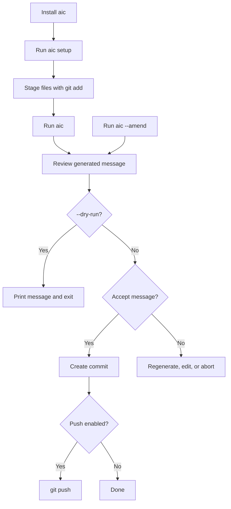

# Documentation

This folder is the detailed documentation entry point for `aic`, the Rust CLI for generating Git commit messages with AI.

## Start Here

- [Installation](installation.md): build and install the `aic` binary.
- [Usage](usage.md): run the commit-message workflow and pass Git flags through.
- [Configuration](configuration.md): set provider, model, prompt, token, hook, and output behavior.
- [Providers](providers.md): choose between OpenAI, Azure OpenAI, Claude Code, and Codex.
- [Hooks](hooks.md): install or remove the Git `prepare-commit-msg` hook.
- [Architecture](architecture.md): understand the Rust modules and data flow.
- [Testing](testing.md): run the verification suite.
- [Roadmap](roadmap.md): see deferred v1 items.
- [Release Notes — 0.0.4](releases/0.0.4.md): latest release notes.
- [Release Notes — 0.0.3](releases/0.0.3.md): previous release notes.
- [Release Notes — 0.0.2](releases/0.0.2.md): previous release notes.
- [Release Notes — 0.0.1](releases/0.0.1.md): initial release notes.

## Workflow Map

