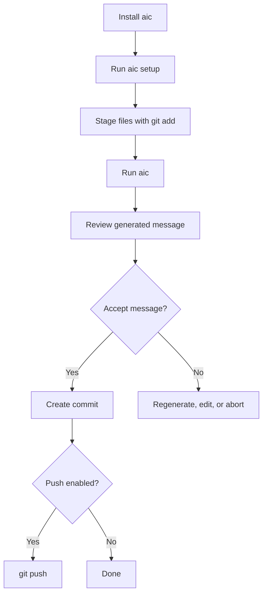

# Documentation

This folder is the detailed documentation entry point for `aic`, the Rust CLI for generating Git commit messages with AI.

## Start Here

- [Installation](installation.md): build and install the `aic` binary.
- [Usage](usage.md): run the commit-message workflow and pass Git flags through.
- [Configuration](configuration.md): set provider, model, prompt, token, hook, and output behavior.
- [Providers](providers.md): choose OpenAI-compatible providers or Ollama.
- [Hooks](hooks.md): install or remove the Git `prepare-commit-msg` hook.
- [Architecture](architecture.md): understand the Rust modules and data flow.
- [Testing](testing.md): run the verification suite.
- [Roadmap](roadmap.md): see deferred v1 items.

## Workflow Map

