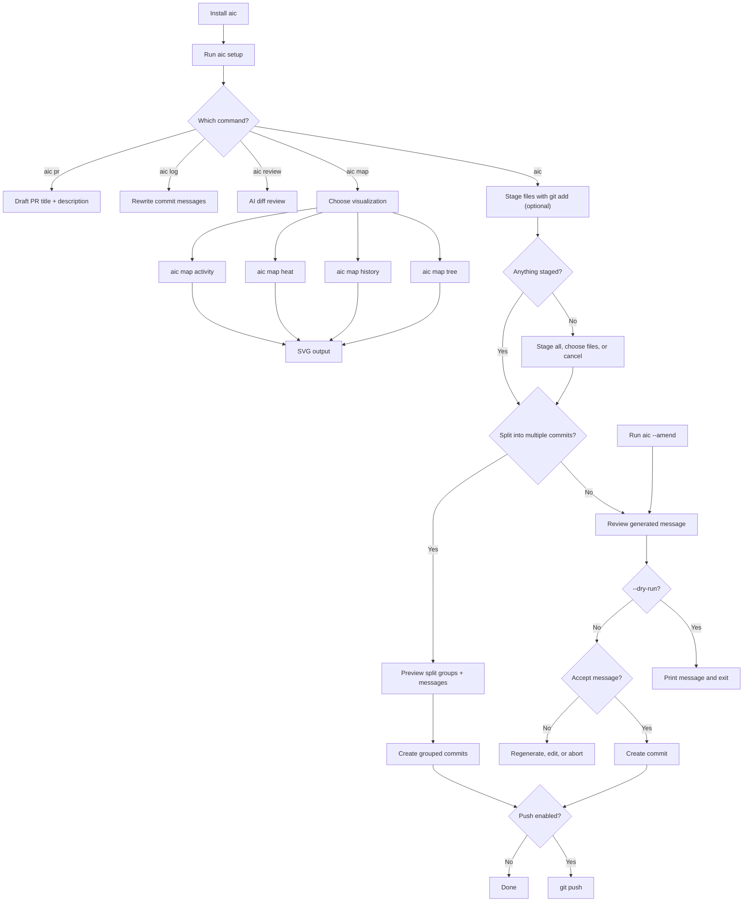

# Documentation

This folder is the detailed documentation entry point for `aic`, the Rust CLI for generating Git commit messages, PR drafts, and reviews with AI.

## Start Here

- [Installation](installation.md): install `aic` with Homebrew, WinGet, direct binaries, or from source.
- [Usage](usage.md): run the commit-message workflow and pass Git flags through.
- [Configuration](configuration.md): set provider, model, prompt, token, hook, and output behavior.
- [Providers](providers.md): choose between OpenAI, Azure OpenAI, Anthropic, Groq, Ollama, Claude Code, Codex, and GitHub Copilot CLI.
- [Hooks](hooks.md): install or remove the Git `prepare-commit-msg` hook.
- [Visualization](map.md): generate SVG treemaps, timelines, heatmaps, and activity graphs.
- [Architecture](architecture.md): understand the Rust modules and data flow.
- [Testing](testing.md): run the verification suite.
- [Roadmap](roadmap.md): see deferred v1 items.
- [Release Notes - Unreleased](releases/unreleased.md): upcoming changes not yet shipped in a tagged release.
- [Release Notes - 0.0.8](releases/0.0.8.md): latest release notes.
- [Release Notes - 0.0.7](releases/0.0.7.md): previous release notes.
- [Release Notes - 0.0.6](releases/0.0.6.md): previous release notes.
- [Release Notes - 0.0.5](releases/0.0.5.md): previous release notes.
- [Release Notes - 0.0.4](releases/0.0.4.md): previous release notes.
- [Release Notes - 0.0.3](releases/0.0.3.md): previous release notes.
- [Release Notes - 0.0.2](releases/0.0.2.md): previous release notes.
- [Release Notes - 0.0.1](releases/0.0.1.md): initial release notes.

## Workflow Map

