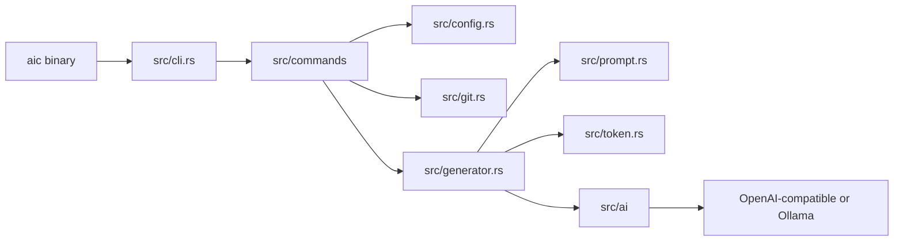
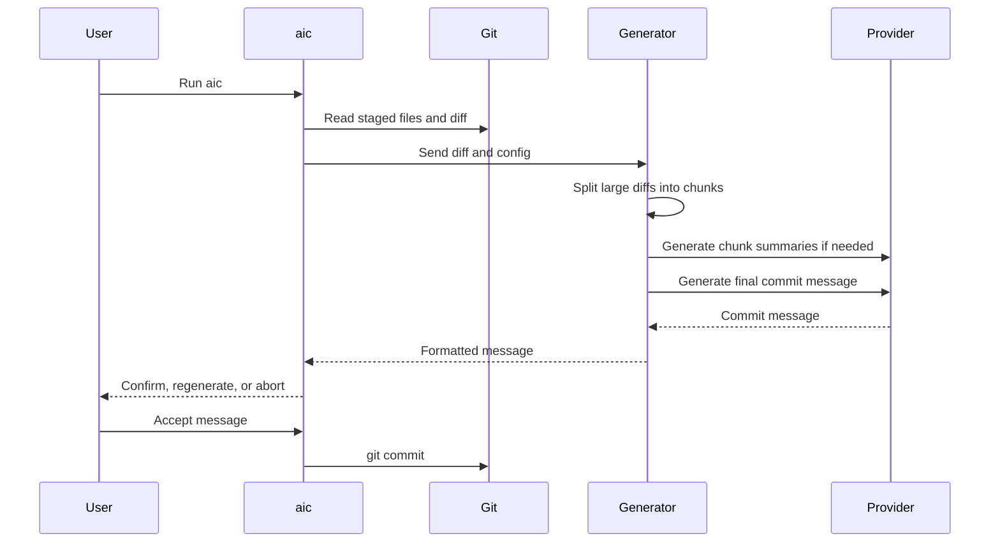

# Architecture

The Rust crate is organized around small modules:

```text
src/cli.rs              CLI parser and dispatch
src/commands/           User-facing command flows
src/config.rs           Defaults, global config, .env, environment overrides
src/git.rs              Git command wrapper and repository helpers
src/prompt.rs           Prompt-template interpolation and response cleanup
src/token.rs            Token counting and diff splitting
src/generator.rs        Prompt, chunking, and AI engine orchestration
src/ai/                 Provider trait and provider implementations
```

The `aic` binary calls the shared library entrypoint.



Provider implementations use an `AiEngine` trait that accepts normalized chat messages and returns a commit message string. This keeps the commit flow independent of provider-specific HTTP payloads.

Git behavior is isolated behind `src/git.rs` so commit, push, hooks, staged-file discovery, and ignore-file filtering are testable without mixing Git process logic into UI commands.

The default system prompt template lives in `prompts/commit-system.md`; use `AIC_PROMPT_FILE` to point at a custom template.

## Commit Generation Flow


