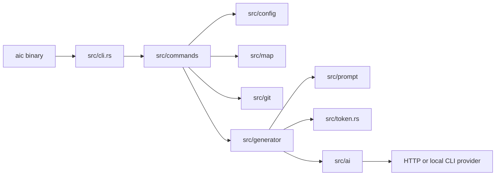
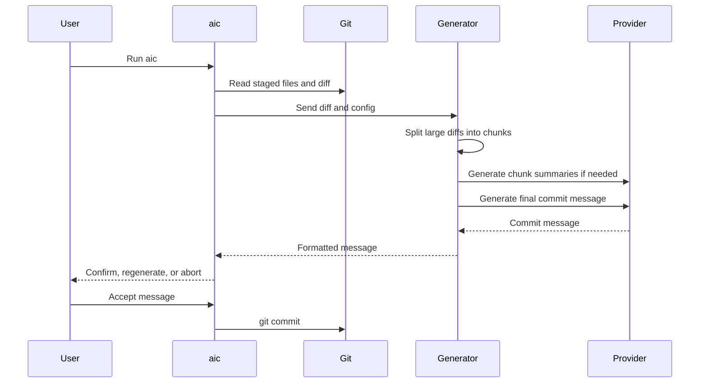

# Architecture

The Rust crate is organized around small modules:

```text
src/cli.rs              CLI parser and dispatch
src/cli_help.toml       Bundled help text and config-key descriptions
src/commands/           User-facing command flows
src/config/             Defaults, global config, loading, parsing, validation, and persistence
src/git/                Git command wrapper, repo helpers, branch logic, remotes, and hooks
src/prompt/             Prompt builders, prompt-template interpolation, and response cleanup
src/token.rs            Token counting and diff splitting
src/generator/          Prompt, chunking, and AI engine orchestration
src/history_store/      Commit and review history persistence
src/map/                SVG visualization renderers (treemap, timeline, heatmap, activity)
src/ai/                 Provider trait and provider implementations
```

The `aic` binary calls the shared library entrypoint.



Provider implementations use an `AiEngine` trait that accepts normalized chat messages and returns a commit message string. This keeps the commit flow independent of transport details such as HTTP payloads or local subprocess execution.

Current provider families:

- OpenAI-compatible HTTP engines for `openai`, `azure-openai`, `groq`, and `ollama`
- Anthropic Messages API engine for `anthropic`
- Command-backed engines for `claude-code` and `codex`

Git behavior is isolated behind the `src/git/` module family so commit, push, hooks, staged-file discovery, branch/base-ref logic, and ignore-file filtering are testable without mixing Git process logic into UI commands.

The largest command and support modules are now folderized to keep responsibilities local without changing public module paths:

- `src/commands/commit/` separates staging, split-commit flow, push handling, and shared helpers behind `commands::commit::run`.
- `src/commands/history/` separates formatting, rendering, and interactive browsing behind `commands::history::run`.
- `src/config/` preserves `crate::config::*` while splitting model defaults, loading, parsing, validation, and writing.
- `src/generator/` preserves `crate::generator::*` while separating commit, PR, and split-plan generation flows.
- `src/prompt/` preserves `crate::prompt::*` while separating commit, review, split, PR, and sanitization helpers.
- `src/history_store/` keeps history persistence separate from the `aic history` command module.
- `src/ai/command/` keeps command-backed provider execution separate from command resolution and test helpers.
- `src/commands/map/` separates the four visualization subcommands (`tree`, `history`, `heat`, `activity`) behind `commands::map`.
- `src/map/` provides SVG rendering: treemap layout, timeline layout, heatmap bars, activity grid, palette helpers, and SVG element utilities.

As a maintenance rule, modules that start combining multiple distinct concerns should usually graduate from a single `*.rs` file into a folder with a `mod.rs` compatibility layer and focused submodules.

Prompt templates live in `prompts/`:

- `commit-system.md` — system prompt for commit message generation. Supports scope hints derived from staged file paths.
- `split-system.md` — system prompt for grouping one staged change set into multiple file-based commits.
- `review-system.md` — system prompt for `aic review` diff analysis.

Use `AIC_PROMPT_FILE` to point at a custom commit prompt template.

## Commit Generation Flow


