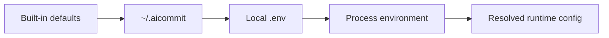

# Configuration

`aic` reads configuration in this order:

1. Built-in defaults
2. Global config at `~/.aicommit`
3. Local `.env`
4. Process environment variables



Set global values:

```sh
aic config set AIC_API_KEY=<key> AIC_MODEL=gpt-5.4-mini
```

Read values:

```sh
aic config get AIC_MODEL AIC_AI_PROVIDER
```

Describe settings:

```sh
aic config describe
aic config describe AIC_MODEL
```

Supported v1 keys:

```text
AIC_AI_PROVIDER
AIC_API_KEY
AIC_API_URL
AIC_API_CUSTOM_HEADERS
AIC_PROXY
AIC_TOKENS_MAX_INPUT
AIC_TOKENS_MAX_OUTPUT
AIC_DESCRIPTION
AIC_EMOJI
AIC_MODEL
AIC_LANGUAGE
AIC_MESSAGE_TEMPLATE_PLACEHOLDER
AIC_PROMPT_FILE
AIC_ONE_LINE_COMMIT
AIC_OMIT_SCOPE
AIC_GITPUSH
AIC_HOOK_AUTO_UNCOMMENT
```

`AIC_TOKENS_MAX_INPUT` defaults to `128000` for new configs.

Example local `.env`:

```env
AIC_AI_PROVIDER=openai
AIC_MODEL=gpt-5.4-mini
AIC_DESCRIPTION=true
AIC_EMOJI=true
```

`AIC_DESCRIPTION` and `AIC_EMOJI` default to `true` for new configs.

## Prompt Template

The default system prompt template lives at `prompts/commit-system.md`.

Use a custom prompt template without recompiling:

```sh
aic config set AIC_PROMPT_FILE=/absolute/path/to/commit-system.md
```

Prompt templates can use these placeholders:

```text
{{commit_convention}}
{{body_instruction}}
{{line_mode_instruction}}
{{scope_instruction}}
{{style_examples}}
{{language}}
{{context_instruction}}
```

Use `.aicommitignore` in a repository to exclude files from AI diff input:

```ignorelang
path/to/large-asset.zip
**/*.jpg
```
