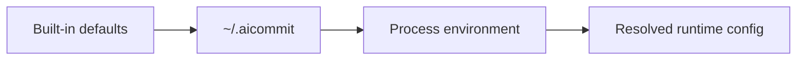

# Configuration

`aic` reads configuration in this order:

1. Built-in defaults
2. Global config at `~/.aicommit`
3. Process environment variables



Set global values:

```sh
aic config set AIC_API_KEY=<key> AIC_MODEL=gpt-5.4-mini
```

Read values:

```sh
aic config get AIC_MODEL AIC_AI_PROVIDER
```

Describe settings:

```sh
aic config describe
aic config describe AIC_MODEL
```

You can also inspect the config subcommands directly:

```sh
aic config --help
aic config set --help
aic config get --help
aic config describe --help
```

`aic config describe` uses the same shared config-key descriptions as the CLI help metadata, so the wording stays aligned across help output, completions, and the config reference commands.

Supported v1 keys:

```text
AIC_AI_PROVIDER
AIC_API_KEY
AIC_API_URL
AIC_API_CUSTOM_HEADERS
AIC_PROXY
AIC_TOKENS_MAX_INPUT
AIC_TOKENS_MAX_OUTPUT
AIC_DESCRIPTION
AIC_EMOJI
AIC_MODEL
AIC_LANGUAGE
AIC_MESSAGE_TEMPLATE_PLACEHOLDER
AIC_PROMPT_FILE
AIC_ONE_LINE_COMMIT
AIC_OMIT_SCOPE
AIC_GITPUSH
AIC_REMOTE_ICON_STYLE
AIC_HOOK_AUTO_UNCOMMENT
```

`AIC_TOKENS_MAX_INPUT` defaults to `128000` for new configs.

Example one-off environment override:

```sh
AIC_MODEL=gpt-5.4-mini aic
```

`aic` intentionally does not read local `.env` files. Project `.env` files often contain unrelated application secrets, cookies, or service credentials, so configuration should be set with `aic config set` or explicit process environment variables instead.

`AIC_DESCRIPTION` and `AIC_EMOJI` default to `true` for new configs.

For Azure OpenAI, set `AIC_AI_PROVIDER=azure-openai`, set `AIC_API_URL` to your Azure OpenAI v1 endpoint, and use your deployment name as `AIC_MODEL`.

For Anthropic, set `AIC_AI_PROVIDER=anthropic` and `AIC_API_KEY`, then optionally override the default `claude-sonnet-4-20250514` model with `AIC_MODEL`.

For Groq, set `AIC_AI_PROVIDER=groq` and `AIC_API_KEY`, then optionally override the default `llama-3.1-8b-instant` model with `AIC_MODEL`.

For local CLI providers, set `AIC_AI_PROVIDER=claude-code` or `AIC_AI_PROVIDER=codex` and leave `AIC_MODEL=default`. These providers use the installed `claude` or `codex` binary from `PATH` and rely on that CLI's existing login state instead of `AIC_API_KEY`.

Use `--provider <name>` to override the configured provider for a single run:

```sh
aic --provider anthropic
aic review --provider groq
aic --provider claude-code
aic review --provider codex
aic log --provider codex --yes
aic models --provider groq
```

The alias `claudecode` is accepted and normalized to `claude-code`.

`AIC_GITPUSH` controls whether `aic` offers a push step after committing. In the normal interactive flow, the single-remote prompt now defaults to `Yes`. With `aic --yes`, `aic` pushes automatically when exactly one remote is configured.

`AIC_REMOTE_ICON_STYLE` controls Git host icons in push prompts. Use `auto` or `nerd-font` for Nerd Font icons with emoji and label fallback, `emoji` for emoji with label fallback, or `label` for plain provider labels only.

## Prompt Template

The default system prompt template lives at `prompts/commit-system.md`.

Use a custom prompt template without recompiling:

```sh
aic config set AIC_PROMPT_FILE=/absolute/path/to/commit-system.md
```

Prompt templates can use these placeholders:

```text
{{commit_convention}}
{{body_instruction}}
{{line_mode_instruction}}
{{scope_instruction}}
{{style_examples}}
{{language}}
{{context_instruction}}
```

Use `.aicommitignore` in a repository to exclude files from AI diff input:

```ignorelang
path/to/large-asset.zip
**/*.jpg
```
