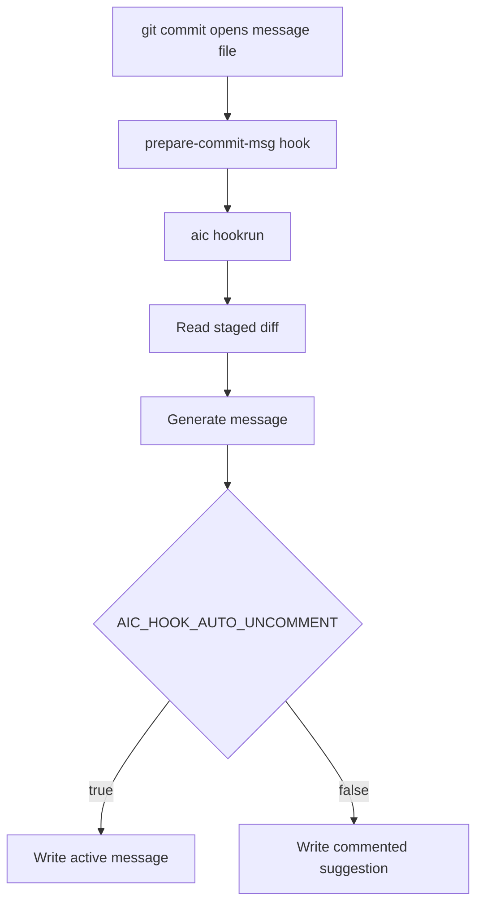

# Hooks

Set a Git `prepare-commit-msg` hook:

```sh
aic hook set
```

Unset it:

```sh
aic hook unset
```

Use the built-in help for a quick reminder of the available hook commands:

```sh
aic hook --help
aic hook set --help
aic hook unset --help
```

When the hook runs, it generates a commit message for staged files and writes it into Git's commit message file.



By default the hook writes the generated message as a comment, so you can review and uncomment it in your editor. To write it uncommented:

```sh
aic config set AIC_HOOK_AUTO_UNCOMMENT=true
```
