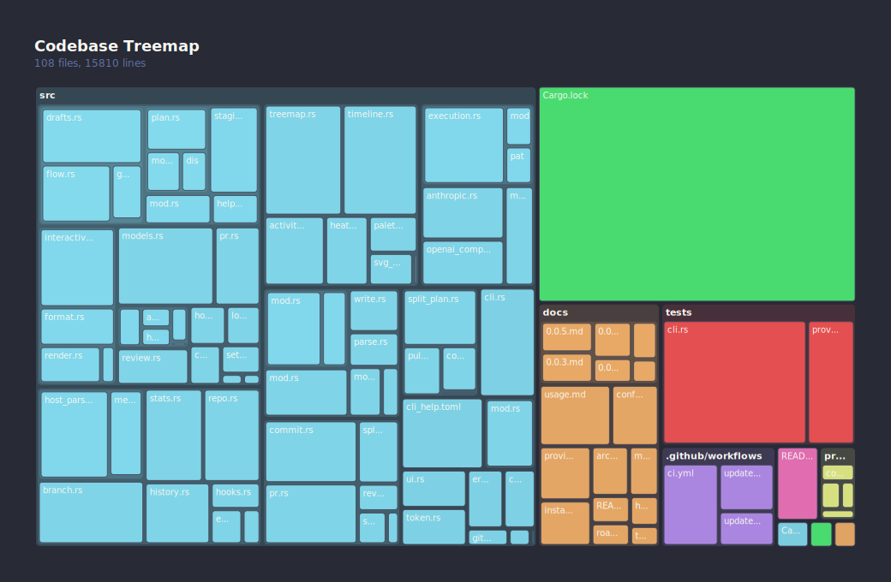
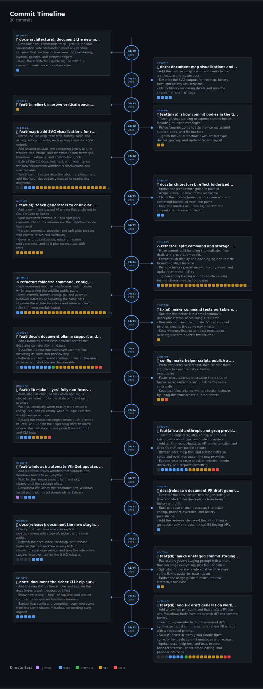
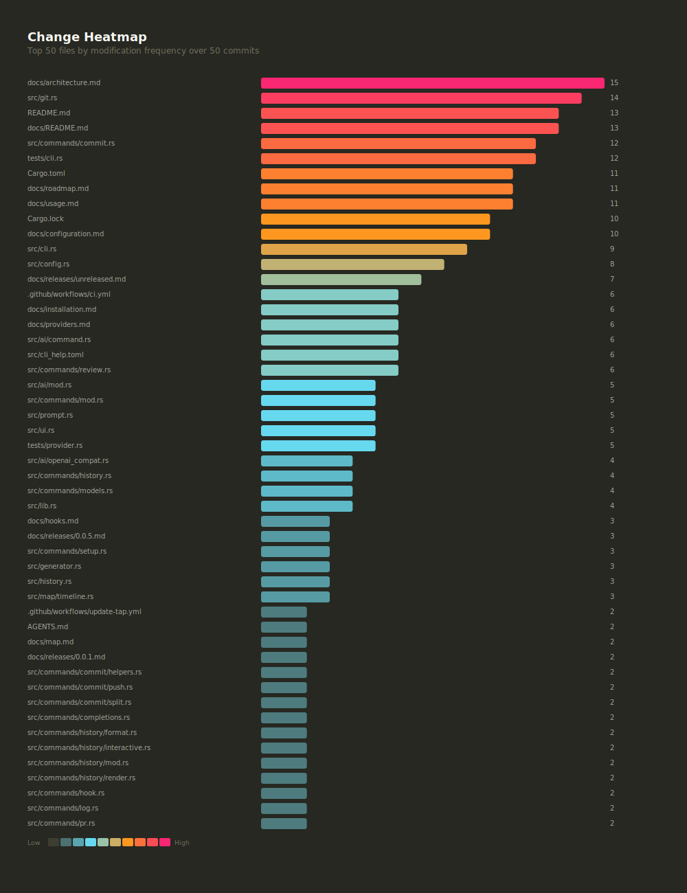
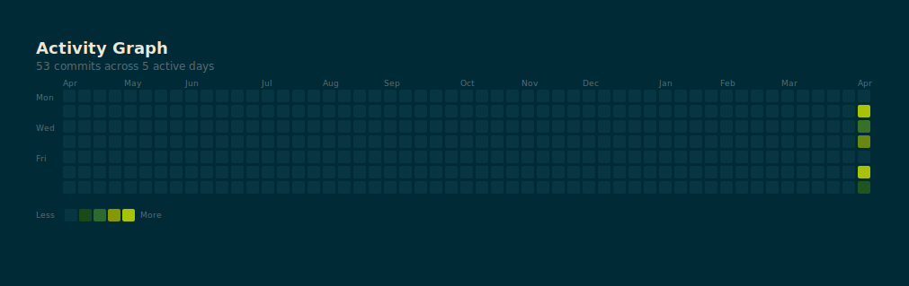

# Visualization - `aic map`

Generate SVG visualizations of the codebase structure and commit history.

## Subcommands

### `aic map tree`

Produces a squarified treemap of the file hierarchy, sized by line count and coloured by top-level directory.

```sh
aic map tree                     # writes aic-treemap.svg
aic map tree -o treemap.svg      # custom output path
```

| Flag       | Default            | Description                                |
|------------|--------------------|--------------------------------------------|
| `-o`       | `aic-treemap.svg`  | Output file path                           |
| `--no-ai`  | off                | Skip AI cluster annotation (reserved)      |
| `--theme`  | `default-light`    | Color theme                                |



### `aic map history`

Draws a vertical zigzag timeline of recent commits. Cards alternate left and right of a central line, with date circles on the spine, full commit messages (subject and body), and file-change dots coloured by directory.

```sh
aic map history                  # last 20 commits
aic map history -n 40            # last 40 commits
```

| Flag | Default             | Description                     |
|------|---------------------|---------------------------------|
| `-o` | `aic-timeline.svg`  | Output file path                |
| `-n` | `20`                | Number of commits to include    |
| `--theme` | `default-light` | Color theme                    |



### `aic map heat`

Renders a horizontal bar chart of files sorted by modification frequency, coloured on a cold-to-hot scale.

```sh
aic map heat                     # last 50 commits
aic map heat -n 200 -o heat.svg  # deeper history
```

| Flag | Default            | Description                       |
|------|--------------------|-----------------------------------|
| `-o` | `aic-heatmap.svg`  | Output file path                  |
| `-n` | `50`               | Number of commits to analyze      |
| `--theme` | `default-light` | Color theme                     |



### `aic map activity`

Generates a GitHub-style contribution grid from commit timestamps over the past 52 weeks.

```sh
aic map activity                 # last 500 commits
aic map activity -n 1000         # larger sample
```

| Flag | Default              | Description                     |
|------|----------------------|---------------------------------|
| `-o` | `aic-activity.svg`   | Output file path                |
| `-n` | `500`                | Number of commits to load       |
| `--theme` | `default-light`  | Color theme                    |



## Themes

All map subcommands accept a `--theme` flag. Available themes:

| Theme | Variant |
|-------|---------|
| `github-light` | Light (default) |
| `github-dark` | Dark |
| `classic-light` | Light |
| `classic-dark` | Dark |
| `solarized-light` | Light |
| `solarized-dark` | Dark |
| `monokai` | Dark |
| `dracula` | Dark |

Theme definitions live in the `themes/` directory as TOML files. Each theme controls background, text, border, accent, and gradient colours.

Example SVGs for every theme and visualization type are in [docs/maps/](maps/).

## Configuration

Create a `.aicommit-map` file in the repository root to set defaults for all map subcommands:

```toml
theme = "dracula"
history_commits = 30
heat_commits = 100
activity_commits = 1000
```

| Key | Default | Description |
|-----|---------|-------------|
| `theme` | `github-light` | Default color theme |
| `history_commits` | `20` | Default commit count for `aic map history` |
| `heat_commits` | `50` | Default commit count for `aic map heat` |
| `activity_commits` | `500` | Default commit count for `aic map activity` |

CLI flags (`--theme`, `-n`) override the config file when specified.

## Output

All subcommands produce standalone SVG files that open in any modern browser. The SVGs use the system font stack and look good at any zoom level.

## Future

- **AI-annotated clusters**: the `tree` subcommand will optionally pass file groupings to the configured AI provider to generate short descriptive labels for each cluster.
