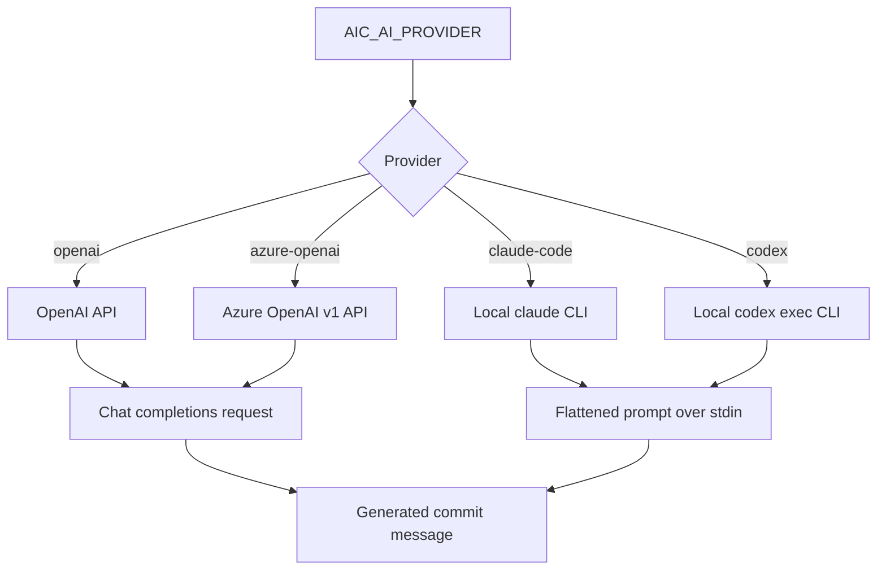

# Providers

V1 ships with these provider paths:

```text
openai
azure-openai
claude-code
codex
```

`openai` and `azure-openai` use the OpenAI chat-completions wire format.

`claude-code` and `codex` are experimental local-binary providers. They use the installed `claude` and `codex` CLIs from your `PATH`, so authentication is managed by those tools rather than `aic`.



Configure OpenAI:

```sh
aic config set AIC_AI_PROVIDER=openai AIC_API_KEY=<key> AIC_MODEL=gpt-5.4-mini
```

The default OpenAI model is `gpt-5.4-mini`, the cost-efficient GPT-5.4 variant.

Use a custom compatible endpoint:

```sh
aic config set AIC_AI_PROVIDER=openai AIC_API_URL=https://example.com/v1
```

This existing `openai` + `AIC_API_URL` path is how `aic` supports OpenAI-compatible providers today. A future roadmap item may still add first-class provider names for specific compatible services, but a separate provider identifier is not required to use custom endpoints now.

Configure Azure OpenAI:

```sh
aic config set AIC_AI_PROVIDER=azure-openai AIC_API_KEY=<key> AIC_API_URL=https://<resource>.openai.azure.com/openai/v1 AIC_MODEL=<deployment-name>
```

For Azure OpenAI, `AIC_MODEL` is the deployment name used by your Azure OpenAI resource. `AIC_API_URL` must point at the Azure OpenAI v1 base URL.

Configure Claude Code:

```sh
aic config set AIC_AI_PROVIDER=claude-code AIC_MODEL=default
```

Configure Codex:

```sh
aic config set AIC_AI_PROVIDER=codex AIC_MODEL=default
```

For local CLI providers, `AIC_MODEL=default` means "use the CLI's own default model". `aic` does not pass a model flag through in v1.

Use `--provider` to override the configured provider for a single run:

```sh
aic --provider claude-code
aic review --provider codex
aic log --provider codex --yes
aic models --provider claude-code
```

The alias `claudecode` is accepted and normalized to `claude-code`.

List cached or fallback models:

```sh
aic models
aic models --refresh
aic models --provider azure-openai
aic models --provider claude-code
```

API-provider model responses are cached at `~/.aicommit-models.json` with a 7-day TTL. Local CLI providers report the static `default` model and a note about the installed binary instead of calling a remote models endpoint.
