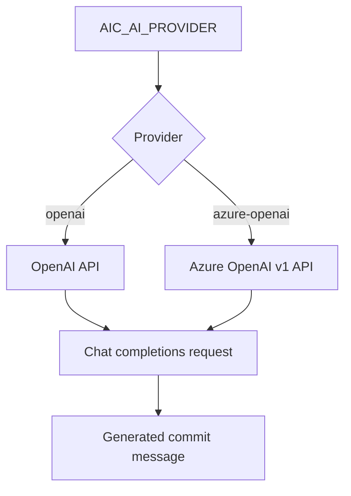

# Providers

V1 ships with these provider paths:

```text
openai
azure-openai
```

Both providers use the OpenAI chat-completions wire format.



Configure OpenAI:

```sh
aic config set AIC_AI_PROVIDER=openai AIC_API_KEY=<key> AIC_MODEL=gpt-5.4-mini
```

The default OpenAI model is `gpt-5.4-mini`, the cost-efficient GPT-5.4 variant.

Use a custom compatible endpoint:

```sh
aic config set AIC_AI_PROVIDER=openai AIC_API_URL=https://example.com/v1
```

Configure Azure OpenAI:

```sh
aic config set AIC_AI_PROVIDER=azure-openai AIC_API_KEY=<key> AIC_API_URL=https://<resource>.openai.azure.com/openai/v1 AIC_MODEL=<deployment-name>
```

For Azure OpenAI, `AIC_MODEL` is the deployment name used by your Azure OpenAI resource. `AIC_API_URL` must point at the Azure OpenAI v1 base URL.

List cached or fallback models:

```sh
aic models
aic models --refresh
aic models --provider azure-openai
```

The model cache is stored at `~/.aicommit-models.json` and uses a 7-day TTL.
