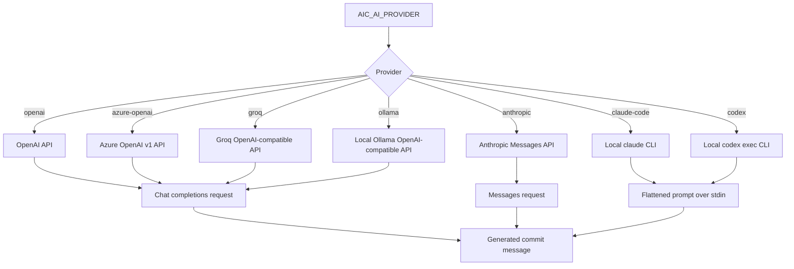

# Providers

V1 ships with these provider paths:

```text
openai
azure-openai
anthropic
groq
ollama
claude-code
codex
```

`openai`, `azure-openai`, `groq`, and `ollama` use the OpenAI chat-completions wire format.

`anthropic` uses Anthropic's Messages API directly.

`claude-code` and `codex` are experimental local-binary providers. They use the installed `claude` and `codex` CLIs from your `PATH`, so authentication is managed by those tools rather than `aic`.



Configure OpenAI:

```sh
aic config set AIC_AI_PROVIDER=openai AIC_API_KEY=<key> AIC_MODEL=gpt-5.4-mini
```

The default OpenAI model is `gpt-5.4-mini`, the cost-efficient GPT-5.4 variant.

Use a custom compatible endpoint:

```sh
aic config set AIC_AI_PROVIDER=openai AIC_API_URL=https://example.com/v1
```

This existing `openai` + `AIC_API_URL` path remains the catch-all way to use other compatible endpoints when you do not want a dedicated provider preset.

Configure Azure OpenAI:

```sh
aic config set AIC_AI_PROVIDER=azure-openai AIC_API_KEY=<key> AIC_API_URL=https://<resource>.openai.azure.com/openai/v1 AIC_MODEL=<deployment-name>
```

For Azure OpenAI, `AIC_MODEL` is the deployment name used by your Azure OpenAI resource. `AIC_API_URL` must point at the Azure OpenAI v1 base URL.

Configure Anthropic:

```sh
aic config set AIC_AI_PROVIDER=anthropic AIC_API_KEY=<key> AIC_MODEL=claude-sonnet-4-20250514
```

Anthropic defaults to `https://api.anthropic.com/v1`. Override `AIC_API_URL` only if you need a proxy or gateway in front of the Anthropic API.

Configure Groq:

```sh
aic config set AIC_AI_PROVIDER=groq AIC_API_KEY=<key> AIC_MODEL=llama-3.1-8b-instant
```

Groq defaults to `https://api.groq.com/openai/v1` and uses the same chat-completions flow as other OpenAI-compatible providers.

Configure Ollama:

```sh
aic config set AIC_AI_PROVIDER=ollama AIC_MODEL=llama3.2
```

Ollama defaults to `http://localhost:11434/v1` and does not require `AIC_API_KEY`. Override `AIC_API_URL` if your Ollama server is running on another host or port.

Configure Claude Code:

```sh
aic config set AIC_AI_PROVIDER=claude-code AIC_MODEL=default
```

Configure Codex:

```sh
aic config set AIC_AI_PROVIDER=codex AIC_MODEL=default
```

For local CLI providers, `AIC_MODEL=default` means "use the CLI's own default model". `aic` does not pass a model flag through in v1.

Use `--provider` to override the configured provider for a single run:

```sh
aic --provider anthropic
aic review --provider groq
aic --provider ollama
aic --provider claude-code
aic review --provider codex
aic log --provider codex --yes
aic models --provider ollama
```

The alias `claudecode` is accepted and normalized to `claude-code`.

List cached or fallback models:

```sh
aic models
aic models --refresh
aic models --provider anthropic
aic models --provider groq
aic models --provider ollama
aic models --provider azure-openai
aic models --provider claude-code
```

API-provider model responses are cached at `~/.aicommit-models.json` with a 7-day TTL. Local CLI providers report the static `default` model and a note about the installed binary instead of calling a remote models endpoint.
